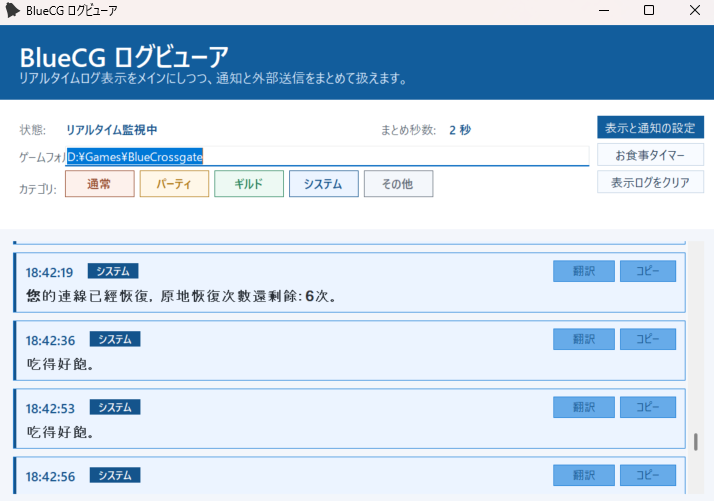

# BlueCG ログビューア

BlueCG のチャットログをリアルタイム表示する Windows デスクトップアプリです。  
複数クライアント起動時に発生する同内容ログの重複をまとめつつ、カテゴリ分類、翻訳、通知、外部送信、お食事タイマーを 1 つのツールで扱えます。

## 主な機能

- リアルタイムログ表示
  `Log` フォルダを監視し、追記されたログを即時表示します。
- 重複ログの自動集約
  近い時刻に流れた同一本文のログを 1 件にまとめます。既定値は `2秒` で、設定画面から変更できます。
- カテゴリ分類とフィルター
  `通常 / パーティ / ギルド / システム / その他` に分類し、表示を絞り込めます。
- URL のクリックオープン
  ログ本文に含まれる URL や `www.` 形式の文字列をクリックしてブラウザで開けます。
- ワンクリックコピー
  各ログカードの `コピー` ボタンから、その行のログをすぐクリップボードへ送れます。
- 翻訳表示
  各ログカードを `翻訳 / 原文` で切り替えられます。翻訳プロバイダは `DeepL API Free`、`Google Cloud Translation`、`OpenAI API` に対応しています。
- 通知と Discord 送信
  既存の通知ルールをサブ機能として残しており、SE 再生や Discord Webhook 送信を設定画面から行えます。
- お食事タイマー
  料理を食べたログを検出し、キャラごとの 3 分クールダウンを別ウィンドウでカウント表示します。

## ログ表示の仕様

- 文字コードは `Big5` 前提です。
- 最新ログが下に流れる時系列表示です。
- 起動時には最近のログを読み込み、その後は追記分を監視します。
- 表示側は仮想化してあり、見えている範囲だけを描画する構成です。

## カテゴリ分類ルール

- `冒頭が [家族] / [家族 ...]` のログは `ギルド`
- `冒頭が [GP]` のログは `パーティ`
- `名前:` の形式で始まる通常発言は `通常`
- システムメッセージらしい形式のものは `システム`
- 上記に当てはまらないものは `その他`

## お食事タイマーの検出ルール

以下のようなログを検出すると、料理を食べたキャラの 3 分クールダウンを開始します。

- `22:00:18丗UME.p恢復了985魔力`
- `22:00:18丗MOMIJI.p替UME.p恢復了985點魔力`

上の例ではどちらも `UME.p` が対象です。  
お食事タイマーの窓を開いていない間も内部では検出・更新されます。

## 設定できる内容

- ゲームフォルダ
- 同一ログのまとめ秒数
- 通知時 SE
- 標準通知ルール
- カスタム通知キーワード
- Discord Webhook URL
- 翻訳プロバイダ
- DeepL / Google / OpenAI の API キー

設定はメイン画面右上の `表示と通知の設定` から開けます。

## 動作環境

- Windows
- `.NET Framework 4.6`
- BlueCG のログフォルダへアクセスできること

## ビルド

Visual Studio で `src/CgLogListener.sln` を開いて `Debug` または `Release` でビルドしてください。

依存ライブラリ:

- `ini-parser`
- `Newtonsoft.Json`

NuGet 復元後に `src/CgLogListener/bin/Debug/CgLogListener.exe` が生成されます。

## 補足

- 設定はアプリ実行フォルダの `settings.ini` と関連ファイルへ保存されます。
- Discord 通知は外部 EXE ではなく本体から直接 Webhook 送信します。
